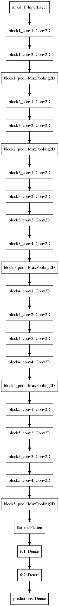

# Neural-Style-Transfer
Neural style transfer is an optimization technique used to take two images—a content image and a style reference image (such as an artwork by a famous painter)—and blend them together so the output image looks like the content image, but “painted” in the style of the style reference image.

Implementation of https://arxiv.org/abs/1508.06576 Research paper from Cornell Univ.

STYLE TRANSFER PROCESS:
<h3 align="center">
  
</h3>

The process follows the use of VGG19 model of CNN which is used for content and style extraction features in the network.

